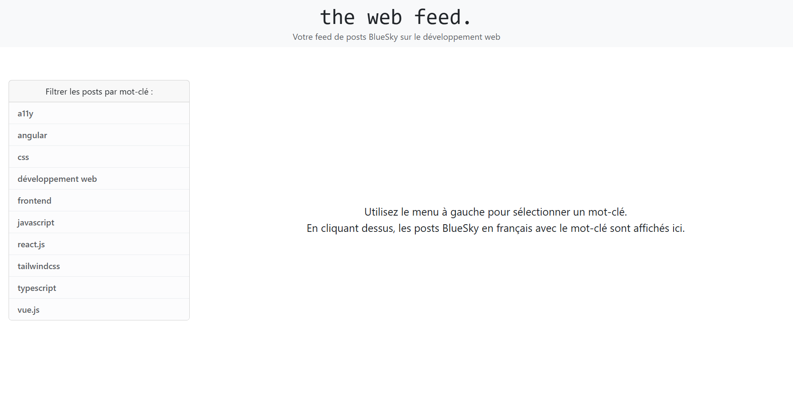
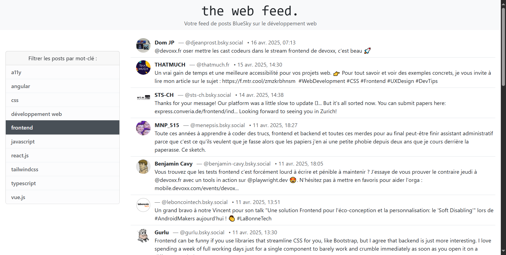
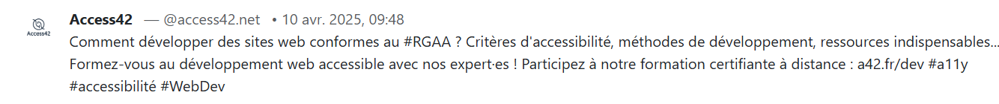

# **Documentation Technique - Projet Bluesky Feed Filter**  

## **📌 Introduction**  
Ce projet consiste en une application web qui filtre les publications (posts) du réseau social **Bluesky** selon des mots-clés prédéfinis liés au développement web. L'application se connecte à l'API publique de Bluesky pour récupérer les posts en français et les affiche dans une interface simple et réactive.  

---

## **🛠️ Technologies & Librairies**   
| Technologie | Version |  
|-------------|---------|  
| React | ^19.0.0 |  
| TypeScript | ~5.7.2 |  
| Vite | ^6.2.0 |  
| Axios | ^1.8.4 |     
| Express | ^4.21.2 |  
| CORS | ^2.8.5 |   

---

## **🌐 API Utilisées**  
### **1. API Bluesky (externe)**  
- **Endpoint** : `https://public.api.bsky.app/xrpc/app.bsky.feed.searchPosts`  
- **Méthode** : `GET`  
- **Paramètres** :  
  - `q` : Mot-clé de recherche (ex: "javascript", "react")  
  - `lang` : Langue des posts (`fr` pour français)  

### **2. API Locale (backend proxy)**  
- **Endpoint** : `http://localhost:3001/api/posts`  
- **Méthode** : `GET`  
- **Paramètres** :  
  - `q` pour le mot-clé de recherche 
- **Rôle** :  
  - Éviter les requêtes directes depuis le frontend (CORS)  
  - Traiter les erreurs et formater les données  

---

## **📂 Architecture Globale**  
```
📁 the-web-feed/
├── 📁 client/                   # Frontend (React + Vite)
│   ├── 📁 node_modules/
│   ├── 📁 public/
│   ├── 📁 src/                  # Composants principaux
│   │   ├── App.tsx              # Point d'entrée
│   │   └── main.tsx             # Configuration Vite
│   ├── index.html               # Template HTML
│   ├── package.json             # Dépendances frontend
│   ├── tsconfig.json            # Configuration TypeScript
│   └── vite.config.js           # Configuration Vite
│
├── 📁 server/                   # Backend (Express)
│   ├── 📁 node_modules/
│   ├── 📁 src/
│   │   ├── 📁 controllers/      # Logique métier
│   │   ├── 📁 entities/         # Modèles de données
│   │   ├── 📁 routes/           # Routes API (ex: bskyRoutes.ts)
│   │   ├── 📁 services/         # Services externes (API Bluesky)
│   │   └── server.ts            # Configuration Express
│   ├── package.json             # Dépendances backend
│   ├── tsconfig.json            # Configuration TypeScript
│   └── README.md                # Documentation serveur
│
└── README.md                    # Documentation globale
```

### **Fonctionnement**  
1. **Frontend** :  
   - L'utilisateur sélectionne un mot-clé (ex: "javascript").  
   - Une requête est envoyée au backend local (`localhost:3001/api/posts?q=javascript`).  
2. **Backend** :  
   - Reçoit la requête et la transmet à l'API Bluesky.  
   - Renvoie les posts filtrés au frontend.  
3. **Affichage** :  
   - Les posts sont affichés sous forme de cartes (titre, auteur, contenu).  

---

## **🗃️ Schéma des Données (Posts Bluesky)**  
Chaque post retourné par l'API Bluesky contient les champs principaux suivants :  
```typescript
type Post = {
  uri: string;          // ID unique (ex: "at://did:.../app.bsky.feed.post/3kjh...")
  author: {
    handle: string;    // Nom d'utilisateur (ex: "user.bsky.social")
    displayName: string;
    avatar: string;   // URL de l'image de profil
  };
  text: string;      // Contenu du post
  createdAt: string; // Date ISO (ex: "2025-04-16T15:11:22.462Z")
}
```

---

## **🎨 Mock-ups / Screenshots**  
### **1. Interface Principale**  
  
- **Zone de filtrage** : Boutons pour sélectionner un mot-clé.  
- **Liste des posts** : Affichage des publications correspondantes.


### **2. Exemple de Post**  
  
- Auteur + Handle  
- Texte du post  
- Date de publication  

---

## **🚀 Installation & Exécution**  
### **1. Backend**  
```bash
cd server
npm install
npm start  # Lance le serveur sur http://localhost:3001
```

### **2. Frontend**  
```bash
cd client
npm install
npm run dev  # Lance l'application sur http://localhost:5173
```